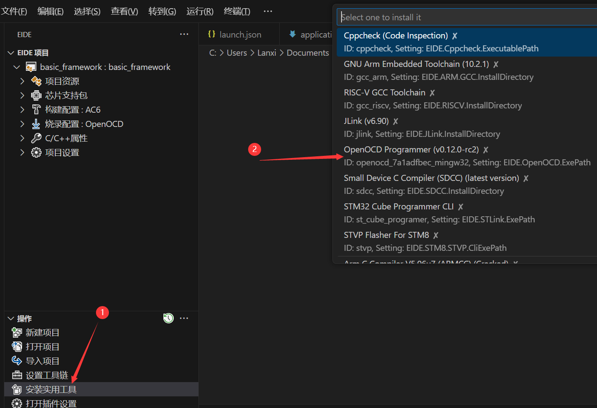
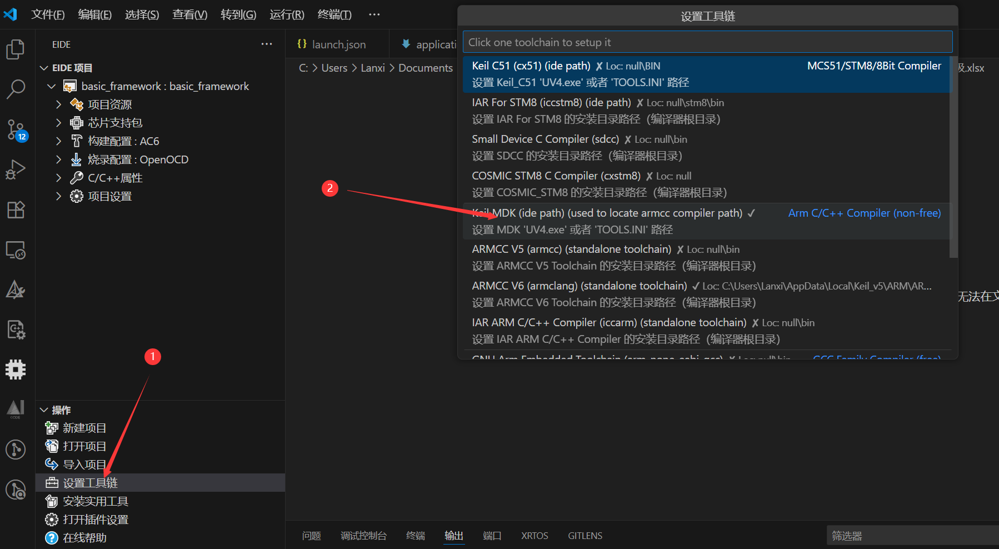
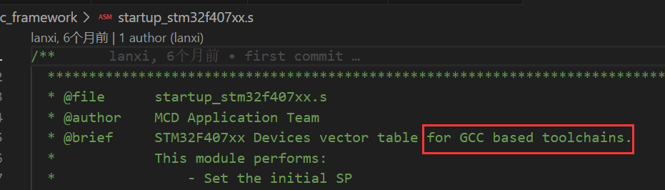
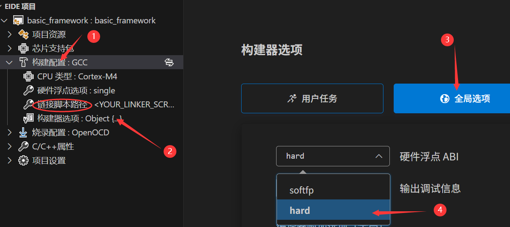

# robomaster泓龙电控组

> 此处是泓龙战队电控组的开源仓库，用于新生快速上手和内部交流
>
> <p align=right>—— 战队的传承与技术突破同等重要</p>

[TOC]

## 文件结构

```

```

1.  [honglong2025: 泓龙电控2025赛季](https://gitee.com/clbw2005/honglong2025)
2.  [泓龙战队24赛季: 用于存放泓龙24赛季的战车控制代码和视觉代码](https://gitee.com/xiyouzhiguang-rm/honglong-team-24-season)

## 快速入门

### 开发环境篇——部署

作为大家接触的第一个IDE，keil伴随着很多人度过了单片机的学习岁月。然而其20世纪的UI界面，缺少的代码补全、高亮和静态检查等功能，以及极慢的编译速度，一直为人诟病

 如今，涌现出的VSCode,Clion等现代化的IDE,凭借着丰富的插件生态，AI支持，以及终于赏心悦目UI界面，获得越来越多开发者的支持。！在现代化开发工具支持下，将极大提高电控开发效率和调试效率

 > 值得注意的是，keil作为ARM的亲生编译器，其开源支持，行业地位仍不可撼动。在转向现代 编译器开发时，不应完全丢下keil，其完全体的ARM调试功能仍无法替代。使用keil时，建议升级版本至V5.40

  #### VScode基本使用

如前所述，VSCode本身只是一个编辑器，它不直接具备编译和调试等各种功能，在此，我们安装插件来使他成为这宇宙第一编译器

- **C/C++**：提供C/C++的调试和代码高亮支持
- **Better C++ Syntax**：提供更丰富的代码高亮和智能提示
- **C/C++ Snippets**：提供代码块（关键字）补全
- **Embedded IDE**:提供后续工程所在的环境，安装后Eide会自动下载一些依赖，没安装NET.6的也会自动安装，注意确认即可
- **Cortex-Debug**，**Cortex-Debug: Device Support Pack - STM32F4**：提供调试支持
- **IntelliCode**，**Makfile Tools**：提供代码高亮支持。喜欢clang的同学可以使用clangd。

同时，VSCode也提供了许多方便的的快捷键，常用快捷键包括：

| 功能                   | 快捷键        |
| ---------------------- | ------------- |
| 选中当前行             | Ctrl+L        |
| 删除当前行             | Ctrl+Shift+K  |
| 重命名变量             | F2            |
| 跳转到定义             | Ctrl+点击     |
| 在打开的文件页中切换   | Ctrl+Tab      |
| 在当前文件查找         | Ctrl+F        |
| 在整个项目文件夹中查找 | Ctrl+Shift+F  |
| 查找所有引用           | Alt+Shift+F12 |
| 返回上一动作           | Alt+左        |

更多快捷键可以按ctrl+K再按ctrl+S显示，并且可以修改成你最习惯的方式，接下来进入编译环境的安装

#### 拉取代码仓库

* **下载安装git**

```bash
sudo apt-get install git #Linux
winget install --id Git.Git -e --source winget #Windows
```

* **拉取战队代码**

```bash
git clone https://gitee.com/clbw2005/honglong2025.git 
```

#### VSCode+Eide

* **Windows  MDK**

安装openocd



下载keil V5.40以上版本并激活，填入MDK路径即可



* **Linux  arm-none-eabi-gcc**

使用apt下载将自动配置好环境变量

```bash
sudo apt install gcc-arm-none-eabi #工具链
sudo apt install make cmake #构建器
sudo apt install openocd #下载器    
```

更换启动文件(.s)，直接覆盖即可

> 启动文件针对keil和gcc有两个版本但名字是一样的，注意区分



填入链接脚本(.ld)路径，勾选硬件浮点



windows 同样可用arm-gcc，使用MinGW下载ARM工具链并配置环境变量即可，其他步骤相同

更多详情可见[VSCode+Ozone使用方法.md]([.Doc/VSCode+Ozone使用方法.md · HNUYueLuRM/basic_framework - Gitee.com](https://gitee.com/hnuyuelurm/basic_framework/blob/master/.Doc/VSCode+Ozone使用方法.md))

#### VSCode+CMake


终端 切换到 build 目录，运行

```bash
cd build
cmake.. && make
```


#### GDB调试


#### 环境问题报错合集


### 代码阅读与使用

> 战队目前使用的是湖南大学跃鹿战队的开源电控框架，其规范的bsp，model,application分层，使得代码结构清晰，层级分明。同时还有仿造ROS的发布订阅机制用于应用间的通信，使得代码耦合度大大下降，复用率高。提高了开发效率。
> 跃鹿原版[readme](https://gitee.com/hnuyuelurm/basic_framework)


## 技术培训 

> 考核包含内容，入队后将默认掌握

  * C语言基础
  * GPIO,TIM,中断
  * 通信（串口）

### 电控组的必备小常识

* 基础的电子常识
* 一口气搞懂计算机网络

### 嵌入式基础

> 战队目前使用的mcu仍然是以stm32f407(c板)为主，后续可能会使用H732(喵板)。现阶段仅要求对stm32hal库的掌握，其他开发板可自行学习扩展技能树，但其内容万变不离其宗，一通即可百通。

#### 深入前面内容的学习并着重掌握

 * DMA的使用
 * CAN通信 

#### 使用DSP库

在F407中，意法半导体提供了专门的硬件加速库arm_math.h，它特别的对于stm32底层硬件做了优化，以至于较我们之前学c阶段使用的math.h大大提高运算速度。因而应当习惯于将平时计算的函数替换为arm所提供的函数。

* **DSP库的导入**

  

#### FreeRtos的基本使用

在前面的单片机的学习中我们清楚的知道并体会了Mcu是单核单线程的运行，以至需要我们不断的去调用中断来满足一些高实时性需求。但中断的触发往往不够可控。使得程序运行的顺序到处乱跳。因此在面临一个较大工程时，仅仅靠中断来满足需求便有点力不从心了。所以我们在此引入Rtos(Real Time os)实时操作系统。

和我们所熟知的Windows,Linux 一样，Rtos是作用于mcu上的操作系统。它通过时间片轮询的方式，实现了多线程的操作。创建的Task之间同时运行，可理解为我们拥有了多个之前裸机开发时的main()函数，程序在里面反复的循环运行。

* **任务的创建**

  

### 算法 

> 算法层面，一方面是控制算法，一方面则是数据处理的算法。电控的最终目的始终是为了控制，而这两者之间往往又是相互依存的

#### PID

PID在控制算法中的地位不必多说，常言到PID解决95%的问题，真要遇上那最后5%不如直接压力机械（bushi）。

 * 代码实现与调参
 * PID的各种优化 

#### 卡尔曼滤波(EKF)


#### 递归最小二乘法（RLS）


## 重要文档


## 参考开源

> 排名不分先后

1. **华南理工大学 华南虎战队**  电控开源SRML库

   - https://github.com/scutrobotlab/RM2021_Hero/tree/master/Chassis/SRML
2. **吉林大学 TARS_Go战队**  电控开源架构

   - https://gitee.com/tarsgo-embedded/UIML
3. **防灾科技学院 思玄战队**  超级电容功率控制算法

   - https://bbs.robomaster.com/forum.php?mod=viewthread&tid=22101
4. **湖南大学 跃鹿战队**  电控开源架构

   - https://gitee.com/hnuyuelurm/basic_framework
5. **青岛大学 XRobot战队**  电控开源架构
   - https://github.com/xrobot-org/XRobot
6. **中国科学技术大学 RoboWalker战队**  功率控制算法 电控教程开源

   - https://git.lug.ustc.edu.cn/users/yssickjgd/projects
7. **哈尔滨工业大学（深圳校区） 南工骁鹰战队**  电控框架开源
   - https://github.com/KGYu0293/Infantry2022V2_mecanum_f407
